# Ручная настройка Metadmin Poll Relay

Эта инструкция повторяет автоматическое развёртывание вручную. Она не использует
3x-ui, Xray, `mod_proxy`, правило `[P]` или WebSocket.

## 1. Как проходит трафик

```mermaid
flowchart LR
    A[Приложения Android] -->|IP-пакеты| B[Android VpnService]
    B -->|TUN → SOCKS5, HEV mapdns| C[Polling SOCKS5]
    C -->|HTTPS: open, up, mux/down, close| D[REG.RU Passenger WSGI]
    D -->|HTTPS + Backend Token| E[Nginx на VPS :443]
    E -->|HTTP только loopback| F[backend.py :18080]
    F -->|Обычные TCP-соединения| G[Интернет]
```



Для каждого TCP-соединения backend хранит отдельный сокет. Отправка телефона на
VPS идёт короткими `POST /up/<session>`. Обратные данные всех соединений VPS
упаковывает в один бинарный ответ `GET /mux/down`. Поэтому один Passenger-процесс
занят ожиданием, а остальные доступны для `open`, `up` и `close`.

## 2. Что потребуется

- VPS с Ubuntu/Debian, root SSH и открытыми TCP 22, 80, 443;
- виртуальный хостинг REG.RU с Python Passenger/WSGI и HTTPS;
- два домена:
  - `backend.example.com` → A-запись на VPS;
  - `relay.example.com` → A-запись на shared-хостинг REG.RU;
- Android-телефон.

Ниже заменяйте имена доменов и токены своими значениями.

## 3. Создание трёх независимых токенов

На своём компьютере или VPS выполните:

```bash
PUBLIC_TOKEN=$(openssl rand -hex 32)
BACKEND_TOKEN=$(openssl rand -hex 32)
PATH_TOKEN=$(openssl rand -hex 32)
printf 'PUBLIC_TOKEN=%s\nBACKEND_TOKEN=%s\nPATH_TOKEN=%s\n' \
  "$PUBLIC_TOKEN" "$BACKEND_TOKEN" "$PATH_TOKEN"
```

Сохраните значения в менеджере паролей. Не публикуйте их в GitHub.

- `PUBLIC_TOKEN` вводится в Android-клиенте;
- `BACKEND_TOKEN` известен только REG.RU и VPS;
- `PATH_TOKEN` скрывает адрес backend endpoint, но не заменяет авторизацию.

## 4. Установка backend на VPS

Подключитесь:

```bash
ssh root@VPS_IP
```

Установите пакеты:

```bash
apt update
apt install -y nginx certbot python3 ca-certificates git
install -d -m 0755 /opt/poll-tunnel /var/www/poll-acme
install -d -m 0700 /etc/poll-tunnel
```

Скачайте только серверный файл из `main`:

```bash
curl -fsSL \
  https://raw.githubusercontent.com/Mendex777/vpn-host-installer/main/poll-tunnel/backend.py \
  -o /opt/poll-tunnel/backend.py
chmod 0644 /opt/poll-tunnel/backend.py
```

Создайте защищённый файл секрета:

```bash
install -m 0600 /dev/null /etc/poll-tunnel/backend.env
nano /etc/poll-tunnel/backend.env
```

Содержимое:

```ini
POLL_BACKEND_TOKEN=ВАШ_BACKEND_TOKEN
```

Установите systemd-службу:

```bash
curl -fsSL \
  https://raw.githubusercontent.com/Mendex777/vpn-host-installer/main/poll-tunnel/poll-backend.service.example \
  -o /etc/systemd/system/poll-backend.service
systemctl daemon-reload
systemctl enable --now poll-backend
systemctl status poll-backend --no-pager
```

Проверьте loopback endpoint:

```bash
set -a
. /etc/poll-tunnel/backend.env
set +a
curl -i -H "Authorization: Bearer $POLL_BACKEND_TOKEN" \
  http://127.0.0.1:18080/health
unset POLL_BACKEND_TOKEN
```

Ожидается `HTTP 200` и JSON `{"status":"ok","sessions":0}`.

## 5. Nginx и сертификат VPS без конфликта на порту 80

Порт 80 остаётся у Nginx. Certbot работает в режиме `webroot`, поэтому он не
запускает второй веб-сервер и не конфликтует с Nginx.

Создайте временный HTTP-конфиг:

```bash
nano /etc/nginx/sites-available/poll-relay.conf
```

```nginx
server {
    listen 80;
    listen [::]:80;
    server_name backend.example.com;

    location ^~ /.well-known/acme-challenge/ {
        root /var/www/poll-acme;
    }

    location / {
        return 404;
    }
}
```

Активируйте и запросите сертификат:

```bash
ln -sfn /etc/nginx/sites-available/poll-relay.conf \
  /etc/nginx/sites-enabled/poll-relay.conf
nginx -t
systemctl reload nginx
certbot certonly --webroot -w /var/www/poll-acme \
  -d backend.example.com -m admin@example.com \
  --agree-tos --non-interactive
```

Теперь замените конфиг на окончательный:

```nginx
server {
    listen 80;
    listen [::]:80;
    server_name backend.example.com;

    location ^~ /.well-known/acme-challenge/ {
        root /var/www/poll-acme;
    }

    location / {
        return 301 https://$host$request_uri;
    }
}

server {
    listen 443 ssl http2;
    listen [::]:443 ssl http2;
    server_name backend.example.com;

    ssl_certificate /etc/letsencrypt/live/backend.example.com/fullchain.pem;
    ssl_certificate_key /etc/letsencrypt/live/backend.example.com/privkey.pem;
    ssl_protocols TLSv1.2 TLSv1.3;

    location ^~ /poll-tunnel/ВАШ_PATH_TOKEN/ {
        proxy_pass http://127.0.0.1:18080/;
        proxy_http_version 1.1;
        proxy_set_header Connection "";
        proxy_set_header Host $host;
        proxy_set_header X-Real-IP $remote_addr;
        proxy_set_header X-Forwarded-For $proxy_add_x_forwarded_for;
        proxy_set_header X-Forwarded-Proto https;
        proxy_buffering off;
        proxy_request_buffering off;
        proxy_cache off;
        client_max_body_size 1m;
        proxy_connect_timeout 5s;
        proxy_read_timeout 40s;
        proxy_send_timeout 40s;
        add_header Cache-Control "no-store" always;
    }

    location / {
        return 404;
    }
}
```

Примените и проверьте автоматическое продление:

```bash
nginx -t
systemctl reload nginx
systemctl status certbot.timer --no-pager
certbot renew --dry-run
```

Проверка внешнего backend URL:

```bash
curl -i \
  -H "Authorization: Bearer ВАШ_BACKEND_TOKEN" \
  https://backend.example.com/poll-tunnel/ВАШ_PATH_TOKEN/health
```

## 6. Создание Python-приложения на REG.RU

В ISPmanager:

1. создайте или откройте домен `relay.example.com`;
2. включите SSL-сертификат для домена;
3. создайте Python-приложение Passenger/WSGI для корня этого сайта;
4. точка входа: `passenger_wsgi.py`, объект приложения: `application`;
5. не создавайте редирект и не используйте `.htaccess [P]`.

Скачайте WSGI-файл на компьютер:

```bash
curl -fsSLO \
  https://raw.githubusercontent.com/Mendex777/vpn-host-installer/main/shared-hosting/passenger_wsgi.py
```

Создайте рядом `relay_config.py`:

```python
PUBLIC_TOKEN = "ВАШ_PUBLIC_TOKEN"
BACKEND_TOKEN = "ВАШ_BACKEND_TOKEN"
BACKEND_BASE = "https://backend.example.com/poll-tunnel/ВАШ_PATH_TOKEN"
```

Загрузите оба файла в корень сайта. Пример для обычного FTP:

```bash
ftp FTP_HOST
```

В интерактивной FTP-консоли:

```text
user FTP_LOGIN FTP_PASSWORD
cd /www/relay.example.com
put passenger_wsgi.py
put relay_config.py
mkdir tmp
cd tmp
put restart.txt
quit
```

Если `restart.txt` отсутствует, создайте локально пустой файл перед загрузкой:

```bash
: > restart.txt
```

В ISPmanager те же действия можно выполнить через файловый менеджер. Файл
`relay_config.py` содержит секреты и не должен быть доступен как статический файл;
домен должен обслуживаться именно Passenger-приложением.

## 7. Проверка REG.RU relay

Без ключа должен быть запрет:

```bash
curl -i https://relay.example.com/health
```

Ожидается `403`.

С ключом:

```bash
curl -i -H "X-Relay-Key: ВАШ_PUBLIC_TOKEN" \
  https://relay.example.com/health
```

Ожидается `200` и JSON backend. Проверка mux endpoint:

```bash
curl -i -H "X-Relay-Key: ВАШ_PUBLIC_TOKEN" \
  'https://relay.example.com/mux/down?wait=0.1'
```

Без активных соединений нормальный ответ — `204 No Content`.

## 8. Сборка и установка Android-клиента

На странице GitHub откройте `Actions` → `Android APK` → последний успешный run →
скачайте artifact `metadmin-relay-debug-apk`. Распакуйте `app-debug.apk`.

Установка через ADB:

```bash
adb install -r -t app-debug.apk
```

В приложении укажите:

```text
URL: https://relay.example.com
Ключ: ВАШ_PUBLIC_TOKEN
```

Нажмите «Подключить» и подтвердите системное разрешение VPN.

Проверка:

```bash
adb shell ip addr show tun0
adb shell curl -4 https://api.ipify.org
```

Вторая команда должна показать IP вашей VPS.

## 9. Диагностика

На VPS:

```bash
systemctl status poll-backend nginx --no-pager
journalctl -u poll-backend -n 100 --no-pager
nginx -t
ss -lntp | grep -E ':80 |:443 |:18080 '
```

На Android:

```bash
adb logcat -d -v brief | grep -E 'HevSocks|PollSocks|AndroidRuntime'
adb shell dumpsys connectivity | grep -A4 'VPN CONNECTED'
```

Типичные причины:

- `403` — неверный public или backend token;
- `404` — не совпадает `PATH_TOKEN` или Nginx location;
- `502` на REG.RU — Passenger не может подключиться к HTTPS backend;
- DNS работает, но TLS зависает — проверьте, что клиент и backend поддерживают
  `/mux/down`, а не старый отдельный `/down/<session>`;
- `tun0` отсутствует — Android не дал разрешение VPN или сервис завершился.

## 10. Обновление и откат

Перед ручной заменой файлов создавайте копии:

```bash
cp -a /opt/poll-tunnel/backend.py \
  /opt/poll-tunnel/backend.py.$(date +%Y%m%d-%H%M%S).bak
cp -a /etc/nginx/sites-available/poll-relay.conf \
  /etc/nginx/sites-available/poll-relay.conf.$(date +%Y%m%d-%H%M%S).bak
```

После обновления backend:

```bash
python3 -m py_compile /opt/poll-tunnel/backend.py
systemctl restart poll-backend
```

Ветка `xhttp_old` содержит старый XHTTP/3x-ui проект и не должна смешиваться с
текущей схемой polling relay.
